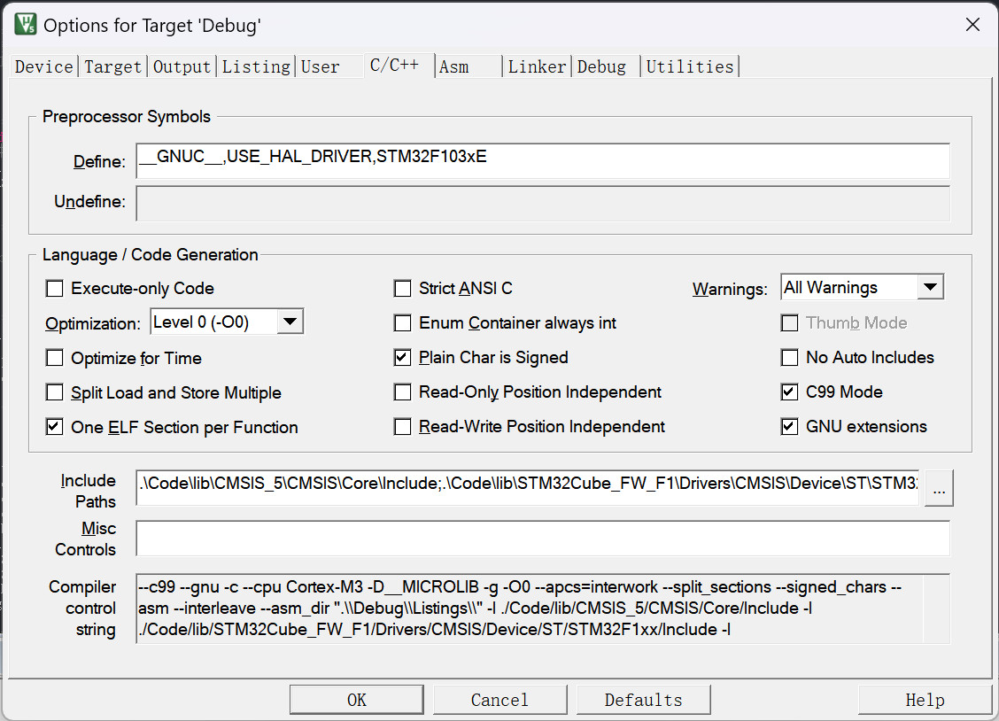
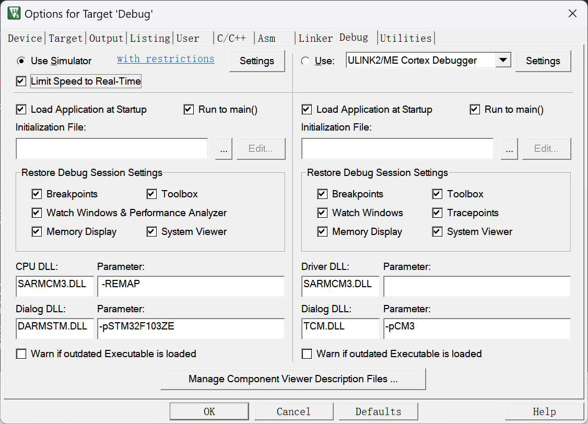

# XCOS 示例说明

**XCOS框架完整功能演示和性能测试**

[测试环境](#-测试环境) • [资源占用](#-资源占用分析) • [示例配置](#-示例配置说明) • [功能演示](#-功能演示)

## 🎯 测试环境

### 开发环境配置

| 项目         | 配置                                     |
| ------------ | ---------------------------------------- |
| **IDE**      | Keil MDK                                 |
| **版本**     | V5.39.0.0                                |
| **工具链**   | ARM Compiler V5.06                       |
| **目标芯片** | STM32F103ZE (软件模拟)                   |
| **优化等级** | -O1（优化大小；工程 `<Optim>1</Optim>`） |

### MDK配置截图

**芯片选择配置**

**编译器配置**

**调试器配置**

## 📊 资源占用分析

> **测量条件**：当前 MDK 工程（`Examples/CortexM3_Test`，12 任务 A0~A11）—— ARM Compiler **V5.06 update 7**、**-O1（优化大小）**、C99、STM32F103ZE；已含 HAL 库启用模块的全部代码。
> 下表为**当前实测值**（每次内核/示例改动后由 [`Tests/run_size.ps1`](../Tests/run_size.ps1) 重新测量，阈值 ±8 B）；口径与最新值见 [`Tests/baseline.md`](../Tests/baseline.md)。

### 固件占用（当前实测）

> 读法：**Code** = Flash 里的代码；**RO/RW** = 常量与已初始化变量；**ZI** = 零初始化变量（开机后占 RAM）。

| 配置             | Code     | RO-data | RW-data | ZI-data  | 说明                                                                                                      |
| ---------------- | -------- | ------- | ------- | -------- | --------------------------------------------------------------------------------------------------------- |
| **默认档**       | **8768** | 380     | 40      | **1944** | 完整功能（12 任务 A0~A11；诊断开关全关）                                                                  |
| **+ 运行统计**   | **8920** | 380     | 56      | **2040** | `XC_CFG_TASK_STATS=1`：内核埋点 + 示例诊断演示；RAM 增量 = 12 × TCB **+8 B** + 示例 4 个观测变量（16 B） |
| **+ 四开关全开** | **9868** | 380     | 56      | **2040** | `ERR_HOOK` + `DEBUG_CHECK` + `TASK_STATS` + `ASSERT`                                                      |

### 关键尺寸（当前实测）

| 项                                         | 值                     | 依据                                                          |
| ------------------------------------------ | ---------------------- | ------------------------------------------------------------- |
| 框架实例 `XCOS_t`                          | **44 B**               | `sizeof()`（周期基线 `sizeof_xcos`）                          |
| 任务控制块 TCB（`XC_TaskCB_t`）            | **44 B**               | `sizeof()`（周期基线 `sizeof_tcb`）                           |
| TCB（打开 `XC_CFG_TASK_STATS`）            | **52 B**（+8 B/任务）  | 追加 `RunCnt`(4B) + `MaxRunTick`(4B)                          |
| TCB（关闭协程嵌套 `XC_CFG_COR_NESTING=0`） | **36 B**（−8 B/任务） | 省去嵌套字段（无 `RegExt`/`SetCorStack`/`Cor_Call`/同轮切父） |
| 协程帧（`XC_CorFrame_t`）                  | **8 B/层**             | 用户按需定义帧栈数组（每层一个），不占框架 RAM                |

**资源效率**: 默认档下 12 个测试任务（含中断通知、协程嵌套、分步注册）的完整固件为 **Flash 8768 B / RAM 1944 B**，适合资源受限的嵌入式环境。

## ⚙️ 示例配置说明

### 配置0 - 基准测试
**用途**: 建立无框架代码的内存占用基准
- 无任何XCOS框架函数和变量(注:文件内有4Byte的全局变量)
- 仅包含基础硬件初始化和HAL库

### 配置1 - 框架核心
**用途**: 测试框架核心开销
- 1个框架句柄 (`XC_OSHandle_t`)
- 嘀嗒中断调用 `XC_Time_TickInc()`
- 框架初始化和启动

### 配置2 - 完整功能测试 (V2.1.0)
**用途**: 全面测试框架所有功能（含 V2.1.0 协程嵌套）
- 12个不同功能的任务（A0~A11）
- 涵盖所有API和中断操作
- 包含空闲回调处理
- 包含协程嵌套（`XC_Task_RegExt`/`XC_Cor_Call`）与分步注册（`XC_Task_SetEntry`/`XC_Task_Add`）测试

## 🛠️ 功能演示

**请查看代码文件**

💡 完整示例代码请查看工程目录 `Examples/CortexM3_Test/`

### 任务清单 (V2.1.0)

| 任务                | 测试内容                                                                   | 关键API                                                                                    |
| ------------------- | -------------------------------------------------------------------------- | ------------------------------------------------------------------------------------------ |
| `Task_A0`           | 基础延时                                                                   | `XC_Cor_Enter`/`XC_Cor_DelayMs`/`XC_Cor_Leave`                                             |
| `Task_A1`/`Task_A2` | 任务通知（提前通知 + 正常通知 + 超时）                                     | `XC_Task_SendNotify`/`XC_Cor_WaitNotifyMs`/`XC_Cor_IsNotifyTimeout`/`XC_Cor_GetNotifyData` |
| `Task_A3`/`Task_A4` | 任务挂起与恢复                                                             | `XC_Task_Suspend`/`XC_Task_Resume`                                                         |
| `Task_A5`           | 任务复位                                                                   | `XC_Cor_Reset`                                                                             |
| `Task_A6`           | 任务移除                                                                   | `XC_Cor_Remove`                                                                            |
| `Task_A7`           | 中断通知唤醒（TIM2 随机周期）                                              | `XC_Task_SendNotify`（中断中）                                                             |
| `Task_A8`           | 中断通知唤醒（TIM3 4参数轮换）                                             | `XC_Task_SendNotify`（中断中，携带数据）                                                   |
| `Task_A9`           | 外部中断（EXTI0~3）手动通知唤醒                                            | `XC_Task_SendNotify`（中断中）                                                             |
| `Task_A10`          | **协程嵌套**：顶层任务 `XC_Cor_Call` 子协程，子层延时/等通知后同轮切父返回 | `XC_Task_RegExt`/`XC_Cor_Call`/`XC_Cor_DelayMs`                                            |
| `Task_A11`          | **分步注册 + 帧栈设置**                                                    | `XC_Task_SetEntry`/`XC_Task_SetCorStack`/`XC_Task_Add`                                     |

### 演示功能完整性
- ✅ 协程基本操作(进入/离开/让出)
- ✅ 精确时间管理(延时/超时)
- ✅ 任务间通信(通知机制)
- ✅ 任务状态管理(挂起/恢复/复位)
- ✅ 动态任务管理(注册/移除)
- ✅ 中断集成(外部/定时器)
- ✅ 低功耗支持(空闲回调)
- ✅ **协程嵌套**(子协程调用/返回/同轮切父)
- ✅ **协程帧栈配置**(RegExt/SetCorStack)
- ✅ **诊断能力演示**（可选，默认关 ⇒ 0 开销，见下节）

### 🩺 诊断能力演示（可选，默认关）

`Code/Main/main.c` 的**空闲回调 `Idle()`** 里演示了两类可选诊断能力，**由编译开关控制、默认全关 ⇒ 相关代码不编译（0 代码 / 0 开销）**：

| 开关                 | 示例调用                                                                | 观测变量（调试器里看）                                                                                                          |
| -------------------- | ----------------------------------------------------------------------- | ------------------------------------------------------------------------------------------------------------------------------- |
| `XC_CFG_DEBUG_CHECK` | `XC_Diag_CheckInvariants(&s_hXCOS0)`（每 256 次空闲抽查一次）           | `s_DiagChkLast` = `XC_CHK_OK` 或"首个失败项编号"（1 链表损坏 / 2 状态↔表 / 3 重复挂表 / 4 计数不符 / 5 嵌套不自洽 / 6 归属错） |
| `XC_CFG_TASK_STATS`  | `XC_Diag_GetRunCnt(&s_hTCBn[0])` / `XC_Diag_GetMaxRunTick(&s_hTCBn[0])` | `s_DiagRunCnt`（A0 运行次数）、`s_DiagMaxRunTick`（A0 最长一次调度槽耗时，单位 Tick）                                           |

**怎么打开**（三选一）：
1. **MDK**：`Options for Target → C/C++ → Define` 追加（如 `XC_CFG_DEBUG_CHECK=1`、`XC_CFG_TASK_STATS=1`）；
2. **脚本/命令行**：见 `Tests/run_size.ps1` —— 它的"统计 / 全诊断"两个配置就是这么构建的（用来量开关打开后多出来的体积）；
3. **断言**（`XC_CFG_ASSERT=1`）需**同时开** `XC_CFG_ERR_HOOK=1` 并由用户实现 `XC_Err_Hook`（见 `Docs/XCOS.md`「错误上报」）。

> 说明：诊断能力**不参与内核运行**（自检只读、统计只记录），全部默认关闭；打开后**每个任务多 8 字节 RAM**（统计档），
> 代码增量见 `Tests/baseline.md`。参数级说明见 [`XC_Config.md`](./XC_Config.md)，语义见 [`XCOS.md`](./XCOS.md)。

---

**📖 完整 API 参考: [API文档](./XCOS.md) • 配置: [配置文档](./XC_Config.md)**

