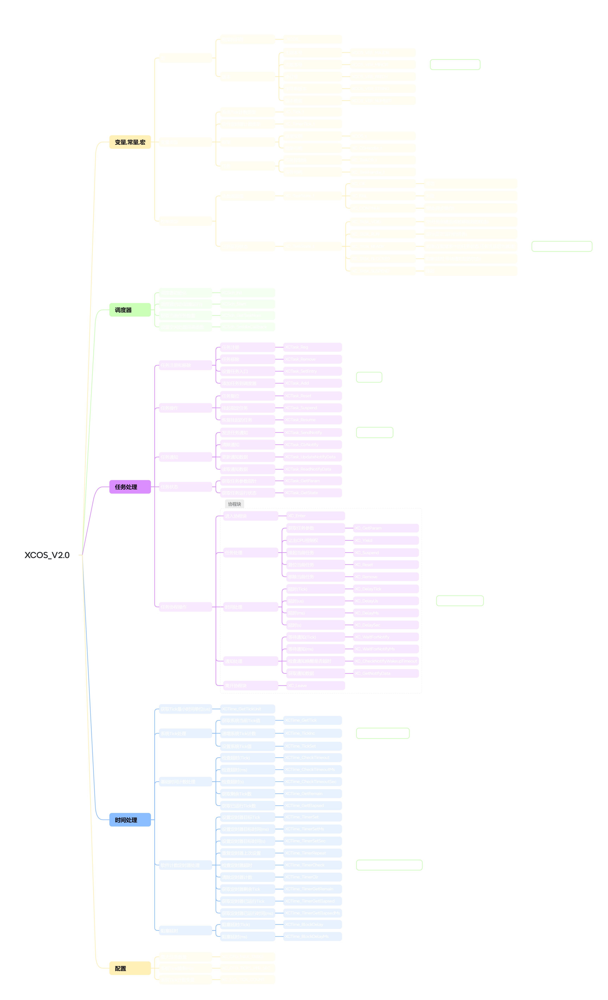

# XCOS API 参考手册

**XCOS框架完整API函数、类型和宏定义参考**

[基础定义](#-基础定义) • [类型系统](#-类型系统) • [常量枚举](#-常量枚举) • [函数参考](#-函数参考) • [调用等级](#-函数调用等级)

## 🏗️ 架构概览

**XCOS框架架构图**

## 📋 基础定义

### 框架标识宏

| 宏名      | 值    | 文件      | 说明          |
| ---       | ---   | ---       | ---           |
| `_XCOS_`  | 2     | XCOS.h    | 框架标识符    |

### 版本信息

| 宏名              | 值        | 文件      | 说明          |
| ---               | ---       | ---       | ---           |
| `XCOS_VER_MAJOR`  | 2         | XCOS.h    | 主版本号      |
| `XCOS_VER_MINOR`  | 0         | XCOS.h    | 次版本号      |
| `XCOS_VER_PATCH`  | 0         | XCOS.h    | 修订号        |
| `XCOS_VER_STRING` | "2.0.0"   | XCOS.h    | 字符串版本    |
| `XCOS_VER_NUMBER` | 0x20000   | XCOS.h    | 版本数值      |

## 🏗️ 类型系统

### 核心数据类型

| 类型名            | 大小(32位)    | 文件          | 说明                  |
| ---               | ---           | ---           | ---                   |
| `XC_Tick_t`       | 4 Bytes       | XC_Config.h   | 系统Tick计数类型      |
| `XC_TimerTick_t`  | 8 Bytes       | XC_Type.h     | 软件定时器计数类型    |
| `XCOS_t`          | 48 Bytes      | XC_Type.h     | XCOS框架实例结构体    |
| `XC_OSHandle_t`   | 4 Bytes       | XC_Type.h     | 框架操作句柄          |
| `XC_TaskCB_t`     | 36 Bytes      | XC_Type.h     | 任务控制块实例        |
| `XC_TaskHandle_t` | 4 Bytes       | XC_Type.h     | 任务操作句柄          |

## 🎯 常量枚举

### 函数返回值类型 (`XC_Return_t`)

| 名称          | 说明              |
| ---           | ---               |
| `XC_OK`       | 成功              |
| `XC_FAIL`     | 失败或无效        |
| `XC_CONTINUE` | 操作继续或未完成  |

### 任务状态类型 (`XC_TaskState_t`)

- 由函数"XCTask_GetState"返回;

| 名称                  | 说明                                          |
| ---                   | ---                                           |
| `XC_TASK_VOID`        | 空(任务创建前或被移除后的状态)                |
| `XC_TASK_RUN`         | 运行(正在运行的任务)                          |
| `XC_TASK_READY`       | 就绪(在就绪表中的任务状态,任务注册后为就绪)   |
| `XC_TASK_BLOCKED`     | 阻塞(延时,等待通知后的状态)                   |
| `XC_TASK_SUSPEND`     | 挂起                                          |

## 🔢 二进制模式

### 二进制常量定义 (`XC_BitPatterns.h`)

提供可视化的二进制模式定义, 便于位操作, 部分示例如下:

| 常量名        | 值    | 说明              |
| ---           | ---   | ---               |
| `_B0`         | 0x00  | 二进制 0          |
| `_B0000_0001` | 0x01  | 二进制 00000001   |
| `_B10100011`  | 0xA3  | 二进制 10100011   |
| `_B1111001`   | 0x79  | 二进制 1111001    |

**特点**:
- 支持1-8位任意二进制常量
- 可使用下划线提高可读性(只支持"4位_4位")
- 直接映射为十六进制值

## 🛠️ 函数参考

📚 共 **52** 个API函数，涵盖嵌入式协程调度所有核心功能

### 调度器模块 (4个函数)

| 函数                      | 类型  | 功能描述              | 文件      |
| ---                       | ---   | ---                   | ---       |
| `XCSch_Init`              | 函数  | 调度器初始化          | XC_Sch.h  |
| `XCSch_Start`             | 函数  | 调度器启动(阻塞运行)  | XC_Sch.h  |
| `XCSch_GetTaskNum`        | 函数  | 获取当前任务数量      | XC_Sch.h  |
| `XCSch_SetIdleCallback`   | 函数  | 设置空闲处理回调函数  | XC_Sch.h  |

### 任务管理模块 (13个函数)

- 任务注册和移除

| 函数                      | 类型  | 功能描述              | 文件      |
| ---                       | ---   | ---                   | ---       |
| `XCTask_Reg`              | 函数  | 任务注册              | XC_Task.c |
| `XCTask_SetEntry`         | 函数  | 分步-设置任务入口     | XC_Task.c |
| `XCTask_Add`              | 函数  | 分步-添加任务到调度器 | XC_Task.c |
| `XCTask_Remove`           | 函数  | 任务移除              | XC_Task.c |

- 任务控制

| 函数                      | 类型  | 功能描述              | 文件      |
| ---                       | ---   | ---                   | ---       |
| `XCTask_Reset`            | 函数  | 任务复位              | XC_Task.c |
| `XCTask_Suspend`          | 函数  | 挂起指定任务          | XC_Task.c |
| `XCTask_Resume`           | 函数  | 恢复挂起的任务        | XC_Task.c |

- 任务通知相关

| 函数                      | 类型  | 功能描述              | 文件      |
| ---                       | ---   | ---                   | ---       |
| `XCTask_SendNotify`       | 函数  | 发送任务通知          | XC_Task.c |
| `XCTask_ClrNotify`        | 宏    | 清除通知              | XC_Task.h |
| `XCTask_UpdateNotifyData` | 宏    | 更新通知数据(void*)   | XC_Task.h |
| `XCTask_ReadNotifyData`   | 宏    | 读取通知数据(void*)   | XC_Task.h |

- 任务参数和状态

| 函数                      | 类型  | 功能描述              | 文件      |
| ---                       | ---   | ---                   | ---       |
| `XCTask_GetParam`         | 宏    | 获取任务参数指针      | XC_Task.h |
| `XCTask_GetState`         | 宏    | 获取任务运行状态      | XC_Task.h |

### 协程块操作 (15个函数)

- 协程范围

| 函数                          | 类型  | 功能描述              | 文件      |
| ---                           | ---   | ---                   | ---       |
| `XC_Enter`                    | 宏    | 进入协程块            | XC_Task.h |
| `XC_Leave`                    | 宏    | 离开协程块            | XC_Task.h |

- 协程控制

| 函数                          | 类型  | 功能描述              | 文件      |
| ---                           | ---   | ---                   | ---       |
| `XC_Yield`                    | 宏    | 让出CPU控制权         | XC_Task.h |
| `XC_Reset`                    | 宏    | 复位当前任务          | XC_Task.h |
| `XC_GetParam`                 | 宏    | 获取任务参数指针      | XC_Task.h |
| `XC_Suspend`                  | 宏    | 挂起当前任务          | XC_Task.h |
| `XC_Remove`                   | 宏    | 移除当前任务          | XC_Task.h |
| `XC_DelayTick`                | 宏    | 延时(Tick)            | XC_Task.h |
| `XC_DelayUs`                  | 宏    | 延时(us)              | XC_Task.h |
| `XC_DelayMs`                  | 宏    | 延时(ms)              | XC_Task.h |
| `XC_DelaySec`                 | 宏    | 延时(s)               | XC_Task.h |
| `XC_WaitForNotify`            | 宏    | 等待通知(Tick)        | XC_Task.h |
| `XC_WaitForNotifyMs`          | 宏    | 等待通知(ms)          | XC_Task.h |
| `XC_CheckNotifyWakeupTimeout` | 宏    | 检查通知唤醒是否超时  | XC_Task.h |
| `XC_GetNotifyData`            | 宏    | 获取通知数据(void*)   | XC_Task.h |

### 时间处理模块 (20个函数)

| 函数                          | 类型  | 功能描述                  | 文件      |
| ---                           | ---   | ---                       | ---       |
| `XCTime_GetTickUnit`          | 宏    | 获取Tick最小时间单位(us)  | XC_Time.h |
| `XCTime_GetTick`              | 宏    | 获取系统当前Tick值        | XC_Time.h |
| `XCTime_TickInc`              | 宏    | 递增系统Tick计数          | XC_Time.c |
| `XCTime_TickSet`              | 宏    | 设置系统Tick值            | XC_Time.c |
| `XCTime_CheckTimeout`         | 宏    | 检查超时(Tick)            | XC_Time.h |
| `XCTime_CheckTimeoutMs`       | 宏    | 检查超时(ms)              | XC_Time.h |
| `XCTime_CheckTimeoutSec`      | 宏    | 检查超时(s)               | XC_Time.h |
| `XCTime_GetRemain`            | 函数  | 获取剩余Tick数            | XC_Time.c |
| `XCTime_GetElapsed`           | 函数  | 获取已运行Tick数          | XC_Time.c |
| `XCTime_TimerSet`             | 宏    | 设置定时器目标Tick        | XC_Time.h |
| `XCTime_TimerSetMs`           | 宏    | 设置定时器目标时间(ms)    | XC_Time.h |
| `XCTime_TimerSetSec`          | 宏    | 设置定时器目标时间(s)     | XC_Time.h |
| `XCTime_TimerRepeat`          | 宏    | 重复定时器上次设置        | XC_Time.h |
| `XCTime_TimerCheck`           | 宏    | 检查定时器超时            | XC_Time.h |
| `XCTime_TimerClr`             | 宏    | 清除定时器计数            | XC_Time.h |
| `XCTime_TimerGetRemain`       | 函数  | 获取定时器剩余Tick        | XC_Time.c |
| `XCTime_TimerGetElapsed`      | 函数  | 获取定时器已运行Tick      | XC_Time.c |
| `XCTime_TimerGetElapsedMs`    | 宏    | 获取定时器已运行时间(ms)  | XC_Time.h |
| `XCTime_BlockDelay`           | 函数  | 阻塞延时(Tick)            | XC_Time.c |
| `XCTime_BlockDelayMs`         | 函数  | 阻塞延时(ms)              | XC_Time.c |

## 🎚️ 函数调用等级

### 调用等级说明

XCOS框架将函数调用分为5个安全等级，确保系统的稳定性和可靠性:

| 等级  | 名称      | 说明                                              |
| ---   | ---       | ---                                               |
| **4** | 协程层    | 只能在协程块内调用(`XC_Enter` 和 `XC_Leave`)之间  |
| **3** | 用户层    | 用户主循环或任务中调用                            |
| **2** | 中断层    | 可在中断上下文调用(每个任务SCSP)                  |
| **1** | 任意层    | 任何上下文均可调用                                |
| **0** | 嘀嗒计数  | 最高优先级, 系统时间基准                          |

**调用规则**: 低等级函数可在高等级上下文中调用，反之则禁止。

### 等级分布表

| 协程层(4)                     | 用户层(3)                 | 中断层(2)             | 任意层(1)                     | 嘀嗒计数(0)       | 函数描述                  |
| ---                           | ---                       | ---                   | ---                           | ---               | ---                       |
| `XC_Enter`                    |                           |                       |                               |                   | 进入协程块                |
| `XC_Leave`                    |                           |                       |                               |                   | 离开协程块                |
| `XC_Yield`                    |                           |                       |                               |                   | 让出CPU控制权             |
| `XC_Reset`                    |                           |                       |                               |                   | 复位当前任务              |
| `XC_GetParam`                 |                           |                       |                               |                   | 获取任务参数指针          |
| `XC_Suspend`                  |                           |                       |                               |                   | 挂起当前任务              |
| `XC_Remove`                   |                           |                       |                               |                   | 移除当前任务              |
| `XC_DelayTick`                |                           |                       |                               |                   | 延时(Tick)                |
| `XC_DelayUs`                  |                           |                       |                               |                   | 延时(us)                  |
| `XC_DelayMs`                  |                           |                       |                               |                   | 延时(ms)                  |
| `XC_DelaySec`                 |                           |                       |                               |                   | 延时(s)                   |
| `XC_WaitForNotify`            |                           |                       |                               |                   | 等待通知(Tick)            |
| `XC_WaitForNotifyMs`          |                           |                       |                               |                   | 等待通知(ms)              |
| `XC_CheckNotifyWakeupTimeout` |                           |                       |                               |                   | 检查通知唤醒是否超时      |
| `XC_GetNotifyData`            |                           |                       |                               |                   | 获取通知数据(void*)       |
|                               | `XCSch_Init`              |                       |                               |                   | 调度器初始化              |
|                               | `XCSch_Start`             |                       |                               |                   | 调度器启动(阻塞运行)      |
|                               |                           |                       | `XCSch_GetTaskNum`            |                   | 获取当前任务数量          |
|                               | `XCSch_SetIdleCallback`   |                       |                               |                   | 设置空闲处理回调函数      |
|                               | `XCTask_Reg`              |                       |                               |                   | 任务注册                  |
|                               | `XCTask_Remove`           |                       |                               |                   | 任务移除                  |
|                               | `XCTask_Reset`            |                       |                               |                   | 任务复位                  |
|                               | `XCTask_SetEntry`         |                       |                               |                   | 设置任务入口              |
|                               | `XCTask_Add`              |                       |                               |                   | 添加任务到调度器          |
|                               |                           | `XCTask_SendNotify`   |                               |                   | 发送任务通知              |
|                               | `XCTask_ClrNotify`        |                       |                               |                   | 清除通知                  |
|                               | `XCTask_Suspend`          |                       |                               |                   | 挂起指定任务              |
|                               | `XCTask_Resume`           |                       |                               |                   | 恢复挂起的任务            |
|                               | `XCTask_GetParam`         |                       |                               |                   | 获取任务参数指针          |
|                               |                           |                       | `XCTask_GetState`             |                   | 获取任务运行状态          |
|                               | `XCTask_UpdateNotifyData` |                       |                               |                   | 更新通知数据(void*)       |
|                               | `XCTask_ReadNotifyData`   |                       |                               |                   | 读取通知数据(void*)       |
|                               |                           |                       |                               | `XCTime_TickInc`  | 递增系统Tick计数          |
|                               |                           |                       | `XCTime_GetTickUnit`          |                   | 获取Tick最小时间单位      |
|                               |                           |                       | `XCTime_GetTick`              |                   | 获取系统当前Tick值        |
|                               |                           |                       | `XCTime_TickSet`              |                   | 设置系统Tick值            |
|                               |                           |                       | `XCTime_CheckTimeout`         |                   | 检查超时(Tick)            |
|                               |                           |                       | `XCTime_CheckTimeoutMs`       |                   | 检查超时(ms)              |
|                               |                           |                       | `XCTime_CheckTimeoutSec`      |                   | 检查超时(s)               |
|                               |                           |                       | `XCTime_GetRemain`            |                   | 获取剩余Tick数            |
|                               |                           |                       | `XCTime_GetElapsed`           |                   | 获取已运行Tick数          |
|                               |                           |                       | `XCTime_TimerSet`             |                   | 设置定时器目标Tick        |
|                               |                           |                       | `XCTime_TimerSetMs`           |                   | 设置定时器目标时间(ms)    |
|                               |                           |                       | `XCTime_TimerSetSec`          |                   | 设置定时器目标时间(s)     |
|                               |                           |                       | `XCTime_TimerRepeat`          |                   | 重复定时器上次设置        |
|                               |                           |                       | `XCTime_TimerCheck`           |                   | 检查定时器超时            |
|                               |                           |                       | `XCTime_TimerClr`             |                   | 清除定时器计数            |
|                               |                           |                       | `XCTime_TimerGetRemain`       |                   | 获取定时器剩余Tick        |
|                               |                           |                       | `XCTime_TimerGetElapsed`      |                   | 获取定时器已运行Tick      |
|                               |                           |                       | `XCTime_TimerGetElapsedMs`    |                   | 获取定时器已运行时间(ms)  |
|                               |                           |                       | `XCTime_BlockDelay`           |                   | 阻塞延时(Tick)            |
|                               |                           |                       | `XCTime_BlockDelayMs`         |                   | 阻塞延时(ms)              |

## 💡 使用建议

### 性能优化

1. **协程块内变量:** 在 `XC_Enter` 前将参数赋值给局部变量;
2. **中断操作:** 通知发送, 挂起恢复等操作可在中断中调用,是线程安全的(每个任务SCSP);
3. **Tick计数:** 确保系统Tick持续运行, 避免时间计算错误;

### 安全使用

1. **调用等级:** 严格遵守API调用等级限制;
2. **任务注册:** 不要重复注册同一任务;
3. **资源管理:** 注意任务移除后的状态管理;

### 错误处理
1. 大部分函数返回 XC_Retuen_t 类型, 建议检查返回值;
2. 协程块内操作无返回值, 需通过状态判断;

---

**📖 完整示例请参考: [示例文档](./Examples.md) • ⚙️ 配置说明请参考: [配置文档](./XC_Config.md)**

