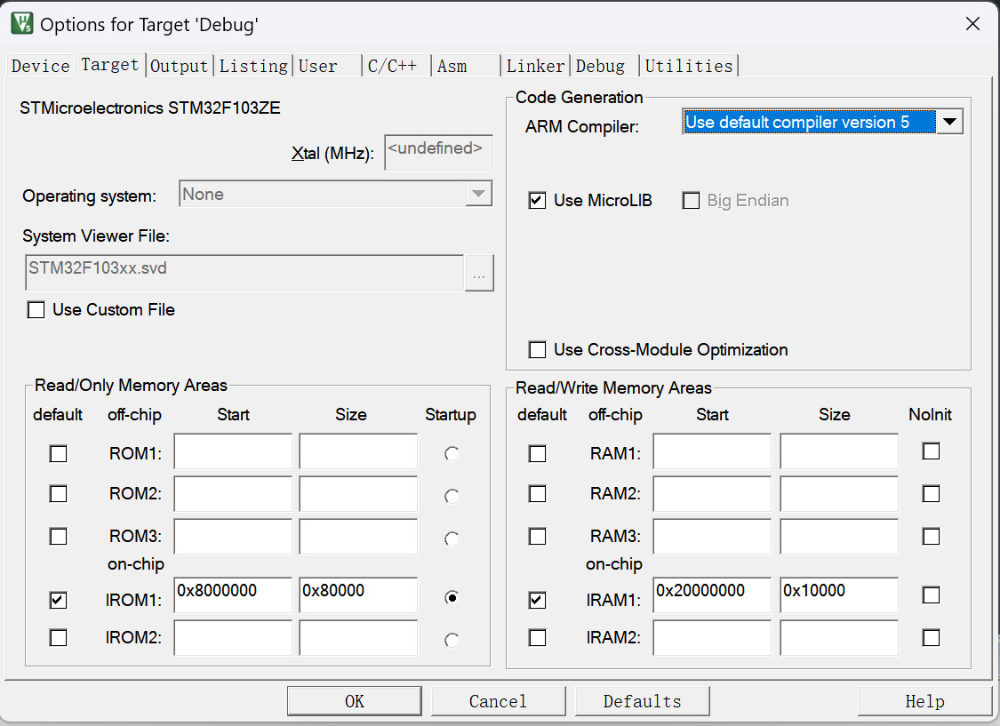

# XCOS 示例说明

**XCOS框架完整功能演示和性能测试**

[测试环境](#-测试环境) • [资源占用](#-资源占用分析) • [示例配置](#-示例配置说明) • [功能演示](#-功能演示)

## 🎯 测试环境

### 开发环境配置

| 项目          | 配置                      |
| ---           | ---                       |
| **IDE**       | Keil MDK                  |
| **版本**      | V5.39.0.0                 |
| **工具链**    | ARM Compiler V5.06        |
| **目标芯片**  | STM32F103ZE (软件模拟)    |
| **优化等级**  | -O0                       |

### MDK配置截图

**芯片选择配置**

**编译器配置**

**调试器配置**

## 📊 资源占用分析

### 内存占用对比表 (MDK -O0)

| 配置      | Code  | RO-data   | RW-data   | ZI-data   | Flash增量     | RAM增量       |
| ---       | ---   | ---       | ---       | ---       | ---           | ---           |
| **基准**  | 4504  | 380       | 16        | 1096      | -             | -             |
| **配置1** | 5352  | 380       | 20        | 1148      | +848 Bytes    | +56 Bytes     |
| **配置2** | 5544  | 380       | 20        | 1188      | +1040 Bytes   | +96 Bytes     |
| **配置3** | 7332  | 380       | 40        | 1640      | +2828 Bytes   | +544 Bytes    |

### 资源占用总结

基于上述测试数据，XCOS框架的资源占用特点如下:

- **框架核心**: 约 **850 Bytes Flash** + **56 Bytes RAM**
- **单个任务**: 约 **190 Bytes Flash** + **40 Bytes RAM**
- **完整应用**(10任务): 约 **2.8 KB Flash** + **544 Bytes RAM**

**资源效率**: 每个新增任务仅增加约200字节Flash和40字节RAM，适合资源受限的嵌入式环境。

## ⚙️ 示例配置说明

### 配置0 - 基准测试
**用途**: 建立无框架代码的内存占用基准
- 无任何XCOS框架函数和变量
- 仅包含基础硬件初始化和HAL库

### 配置1 - 框架核心
**用途**: 测试框架核心开销
- 1个框架句柄 (`XC_OSHandle_t`)
- 嘀嗒中断调用 `XCTime_TickInc()`
- 框架初始化和启动

### 配置2 - 单任务演示
**用途**: 测试单个任务的内存开销
- 包含配置1的所有内容
- 添加1个纯延时任务

### 配置3 - 完整功能测试
**用途**: 全面测试框架所有功能
- 10个不同功能的任务
- 涵盖所有API和中断操作
- 包含空闲回调处理

## 🛠️ 功能演示

💡 完整示例代码请查看工程目录 `examples/CortexM3_Test/`

### 测试场景详解

#### 🔄 任务间通信测试 (A1/A2, A3/A4)
- **A1任务**: 周期性发送通知给A2任务(正确和错误数据交替)
- **A2任务**: 等待通知并验证数据正确性，处理超时情况
- **验证指标**:
  - 任务计数匹配: `A1TaskCount == A2TaskCount`
  - 错误数据匹配: `A2ErrorCount == A1SendErrorCount`
  - 无超时发生: `A2TimeoutCount == 0`

#### ⏰ 任务管理测试 (A5/A6)
- **A5任务**: 演示任务复位功能，每10秒自动重启
- **A6任务**: 演示任务自我移除，计数达到阈值后删除自身
- **验证指标**:
  - A5复位计数: `s_A5TaskCount` 按固定周期递增
  - A6移除时机: `s_A6TaskCount` 最终停留在10

#### 🔧 中断交互测试 (A7/A8/A9)
- **A7任务**: 通过外部中断恢复挂起的任务
- **A8任务**: 通过外部中断发送任务通知和挂起操作
- **A9任务**: 通过定时器中断发送周期性通知
- **验证指标**:
  - 中断计数匹配: `IntSendCount == TaskCount` (A7)
  - 通知成功率: `IntNotifySendCount == SucceedCount` (A8)
  - 周期性触发: `IntTaskCount == A9TaskCount` (A9)

### 中断配置

#### 外部中断映射
| GPIO引脚  | 中断功能  | 关联任务  |
| ---       | ---       | ---       |
| **PIN_0** | 任务恢复  | Task_A7   |
| **PIN_1** | 通知发送  | Task_A8   |
| **PIN_2** | 任务挂起  | Task_A8   |
| **PIN_3** | 任务恢复  | Task_A8   |

#### 定时器中断
- **定时器**: TIM2
- **循环周期**: 32ms
- **功能**: 向Task_A9发送周期性通知
- **动态调整**: 根据任务测试需求可调整中断周期

## 📈 性能分析

### 内存效率
- **框架核心**: < 1KB Flash + < 60B RAM
- **单个任务**: ~200B Flash + 40B RAM
- **完整测试**: < 3KB Flash + < 550B RAM

### 功能完整性
- ✅ 协程基本操作(进入/离开/让出)
- ✅ 精确时间管理(延时/超时)
- ✅ 任务间通信(通知机制)
- ✅ 任务状态管理(挂起/恢复/复位)
- ✅ 动态任务管理(注册/移除)
- ✅ 中断集成(外部/定时器)
- ✅ 低功耗支持(空闲回调)

## 🎯 测试结论

### 资源占用优势
- ⚡ **极低内存**: 框架核心仅56字节RAM
- ⚡ **紧凑代码**: 完整功能小于3KB Flash
- ⚡ **线性扩展**: 任务增加带来的开销可预测

### 功能完整性
- 🔧 **全面覆盖**: 涵盖嵌入式系统常见需求
- 🔧 **易于集成**: 与现有HAL库无缝配合

### 适用场景验证
- ✅ **资源受限**: 适合RAM < 2KB的MCU
- ✅ **实时要求**: 协作式调度满足大多数应用
- ✅ **低功耗**: 可支持休眠模式
- ✅ **复杂逻辑**: 多任务协作处理复杂业务

---
